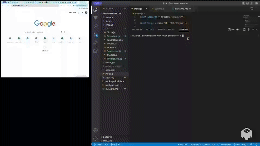

# Logo-generator

This application is a SVG Logo Maker.

## Description
This application was made with Node.js. It helps quickly create a Logo for a project.

## Usage
1. Open Terminal.
2. Enter node index.js.
3. Answer the questions.
4. Get Logo for your project.

## Technologies Used
- Node.js

## Contribution guidelines
1. To make some changes create a feature branch. This is the branch where you will be adding a new code.
2. In the feature branch make commits of all the  changes in your code while working.
3. Push up the changes to feature branch in GitHub repo.
4. Open pull request.
5. Wait untill pull request is approved.

## Test instructions
1. Open Terminal.
2. Enter npm test.

## Mock-Up
The following video shows the wed-site appearance and functionality:

To watch a video open this link:
https://drive.google.com/file/d/1RZN_d7Rs2uL2D9WQqAl8IuZ1UxVfK20b/view?usp=sharing

